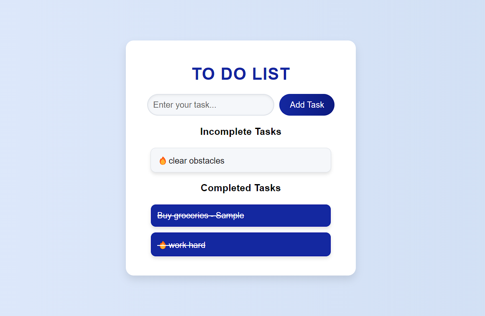

# To-Do-List-using-Javascript


This project is a simple To-Do List web app. Users can manage their daily tasks by adding, completing, and tracking them in real time. Completed tasks are moved to a separate list, and they are visually updated with a strike-through and color change to indicate completion.

## Features

- **Add Tasks**: Easily add new tasks to the "Incomplete Tasks" section with a simple input field.
- **Complete Tasks**: Click on a task to mark it as completed, moving it to the "Completed Tasks" section.
- **Visual Updates**: Completed tasks have a distinctive style, with a strike-through and background color change.
- **Responsive Design**: The web app is fully responsive and optimized for different screen sizes.

## Technologies Used

- **HTML5**: For the basic structure and layout of the To-Do List.
- **CSS3**: Samsung-themed styling for a modern and clean look.
- **JavaScript**: Adds functionality to dynamically update and manage tasks.

## Getting Started

### Prerequisites

Ensure that you have the following installed:
- A modern web browser (e.g., Chrome, Firefox, Edge)
- Basic knowledge of HTML, CSS, and JavaScript

### How to Use

1. Clone the repository:
    ```bash
    git clone https://github.com/AntoJebi7/To-Do-List-Javascript.git
    ```

2. Open the project folder:
    ```bash
    cd To-Do-List-Javascript
    ```

3. Open `index.html` in your browser to launch the app.

4. Enter a task in the input field and click **Add Task** to add the task to your list.

5. Click on any task in the **Incomplete Tasks** section to mark it as completed. It will be moved to the **Completed Tasks** section and updated with a new style.

## Code Structure

### HTML
The HTML defines the structure of the page, including input fields, buttons, and task lists.

### CSS
The CSS file (`styles.css`) applies Samsung-themed styles, including custom fonts, colors, and layouts. Completed tasks get a special style with strike-through and background color changes.

### JavaScript
The JavaScript handles the core functionality, including:
- Adding new tasks to the list
- Marking tasks as completed
- Moving tasks between lists

## Future Enhancements

- **Edit Tasks**: Allow users to edit existing tasks.
- **Remove Tasks**: Add the ability to delete tasks.
- **Task Persistence**: Save tasks in local storage so they persist after page refresh.

## Contributing

Contributions are welcome! Feel free to open issues or submit pull requests to improve the app.

### Steps to Contribute

1. Fork the repository.
2. Create a new branch:
    ```bash
    git checkout -b feature-branch-name
    ```
3. Commit your changes:
    ```bash
    git commit -m "Description of changes"
    ```
4. Push to the branch:
    ```bash
    git push origin feature-branch-name
    ```
5. Open a pull request on GitHub.

